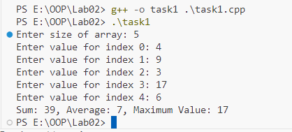
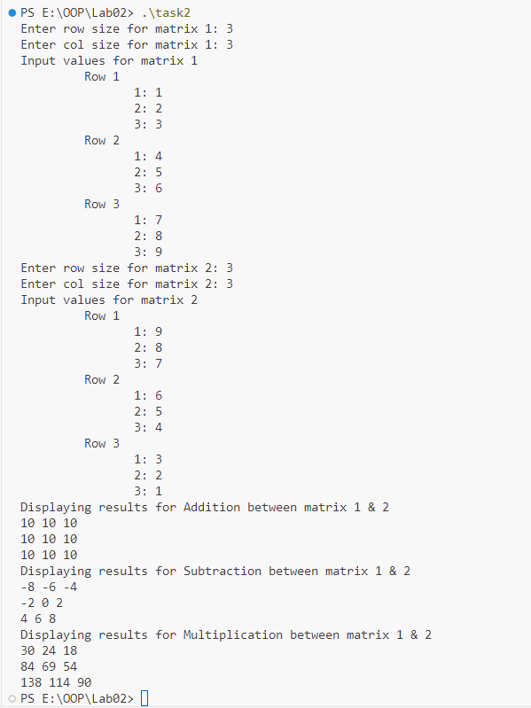
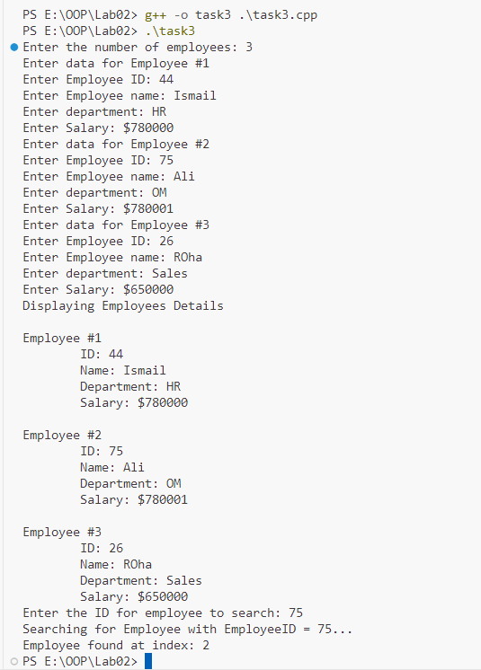
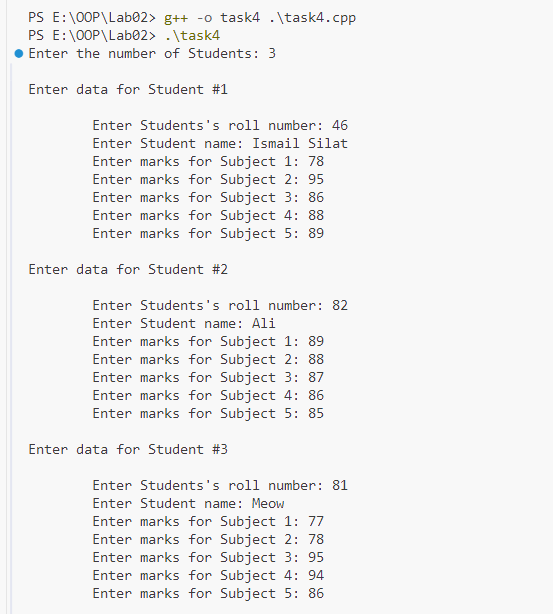
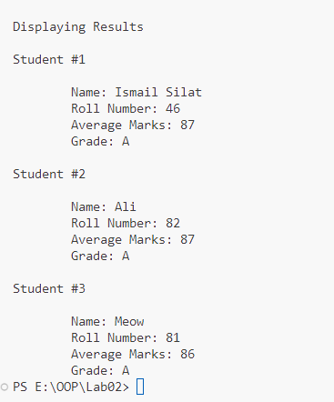
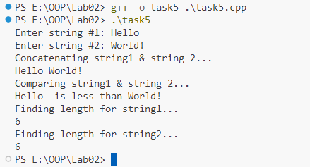
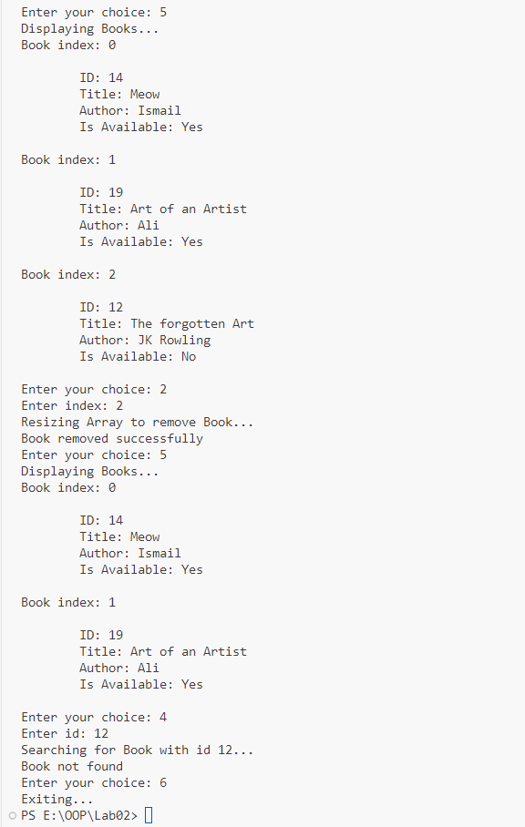
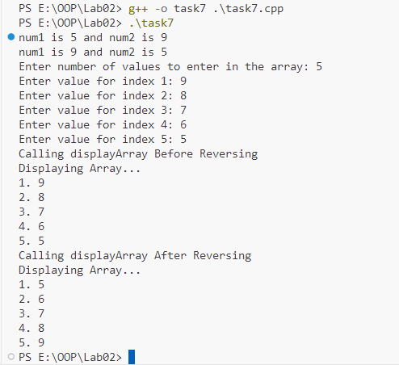
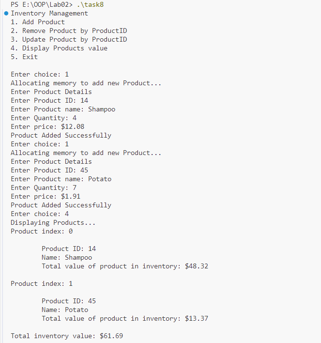
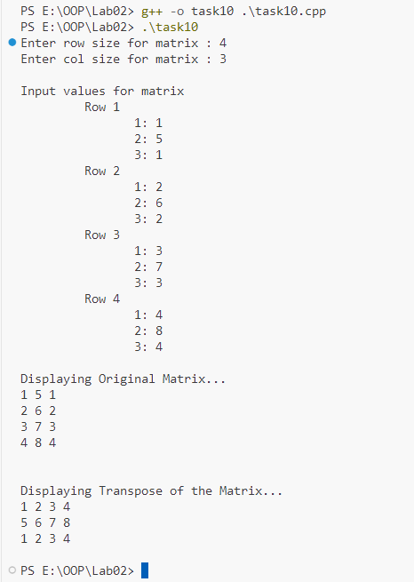

**OOP Lab 02 Tasks**

Ismail Silat - 24K0546

Task 1: Dynamic Array Manipulation

{width="4.621029090113736in"
height="2.107189413823272in"}

Task 2: 2D Matrix Operation

{width="6.239583333333333in"
height="8.322916666666666in"}

Task 3: Employee Management System

{width="5.572916666666667in"
height="7.770833333333333in"}

Task 4: Student Grade Calculator

{width="4.376260936132983in"
height="4.838542213473316in"}

{width="3.0448140857392825in"
height="3.6652307524059493in"}

Task 5: Dynamic String Manipulation

{width="3.357337051618548in"
height="1.8385422134733158in"}

Task 6: Library Management System

{width="5.859375546806649in"
height="7.547882764654418in"}

{width="6.0in" height="9.458333333333334in"}

Task 7: Pointers and Functions

{width="5.145833333333333in"
height="4.708333333333333in"}

Task 8: Inventory Management System

{width="4.282762467191601in"
height="4.578125546806649in"}

{width="4.296875546806649in"
height="3.9034995625546807in"}

Task 9: DMA for Records

{width="3.415084208223972in"
height="4.817708880139983in"}

Task 10: Matrix Transpose using Pointers

