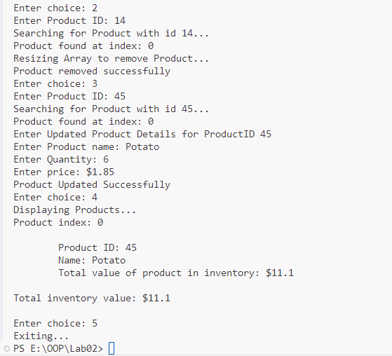

**OOP Lab 02 Tasks**

Ismail Silat - 24K0546

Task 1: Dynamic Array Manipulation

Task 2: 2D Matrix Operation

Task 3: Employee Management System

Task 4: Student Grade Calculator

Task 5: Dynamic String Manipulation

Task 6: Library Management System

{width="6.0in" height="9.458333333333334in"}

Task 7: Pointers and Functions

Task 8: Inventory Management System

Task 9: DMA for Records

Task 10: Matrix Transpose using Pointers

