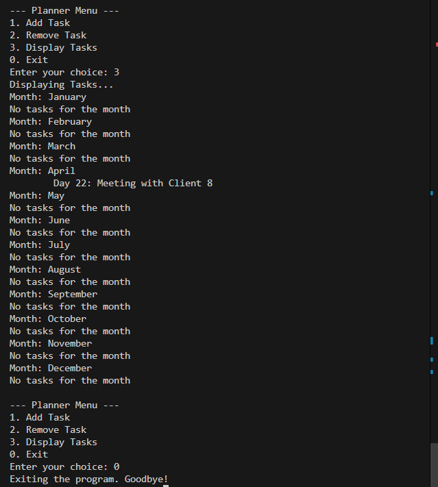

**OOP Lab 03 Tasks Output**

Ismail Silat - 24K0546

**Task 1:**

Ahmed, a school teacher in Lahore, loves using **MarkerPens** to explain
lessons on the whiteboard, but he often forgets to check if they still
have ink. To avoid interruptions in his classes, he needs a system to
track his markers. Create a **MarkerPen** class with attributes like
**brand**, **color**, **inkLevel**, and **refillability**. Implement
methods to **write**, which decreases the ink level, and **refill**,
which restores the ink if the marker is refillable. Help Ahmed by
designing a program where he can check the status of his markers and
refill them when needed.

**Output:**

**Task 2:**

Fatima, a university student in Karachi, loves drinking tea while
studying, but she often loses track of how much is left in her mug. She
needs a smart way to monitor her tea consumption. Design a **TeaMug**
class with attributes for **brand**, **color**, **capacity**, and
**currentFillLevel**. Implement methods to **sip tea** (reducing the
fill level), **refill the mug**, and **check if it's empty**. Fatima
needs a system to remind her when it's time for a fresh cup---can you
create one?

**Output:**

**Task 3:**

Hassan is a wedding planner in Islamabad, managing multiple events every
month. He struggles to keep track of tasks for different clients. To
organize his schedule, he needs a **Planner** that allows him to store
one task per day, update it when needed, and review his schedule at any
time. Implement a **Planner** class that contains an array for each
month, stores one task per day, and includes methods to **add, remove,
and display tasks**. Help Hassan create a system where he can
efficiently manage wedding bookings and event schedules.

**Output:**

**Task 4:**

Bilal and Ayesha, two friends from Lahore, are always debating about
whose laptop is better. They need a system that can store and display
the specifications of different laptop models. Create a **Laptop** class
with attributes like **brand**, **model**, **processor**, **RAM**, and
**storage**. Implement methods to **turn on/off, run a program, and
check specifications**. Your task is to design a system where Bilal and
Ayesha can enter details about their laptops and compare them.

**Output:**

**Task 5:**

Zainab owns a small grocery store in Multan and wants to improve her
inventory management. She needs a program to keep track of items and
their prices, update prices when necessary, and generate a receipt for
customers. Design a **GroceryStore** class with a list of items and
prices, along with methods to **add new items, update prices, view
inventory, and generate a receipt**. Help Zainab create a digital system
to make her store more efficient and customer-friendly.

**Output:**

